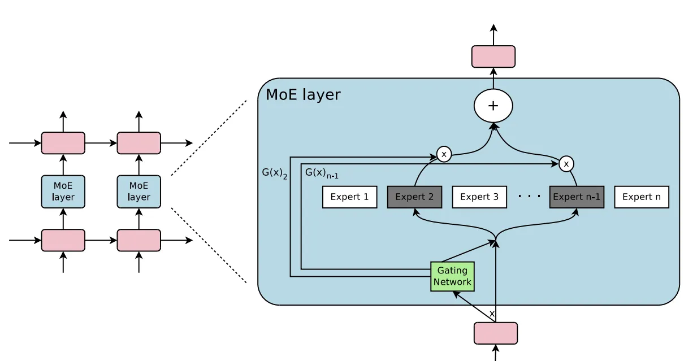

#### 混合专家模型 (Mixture of Experts, MOE) 是什么
[参考1](https://www.tensorops.ai/post/what-is-mixture-of-experts-llm), [参考2](https://zhuanlan.zhihu.com/p/674698482), [参考3](https://arxiv.org/pdf/1701.06538.pdf)

- 谷歌 2017 年在自然语言处理首次应用的混合专家模型（Mixture of Experts，简称MoE）是一种先进的神经网络架构，它通过混合多个专家模型来提升 LLM 性能。在 MoE 中，每个专家模型都专注于特定的子任务或领域。例如，一个专家模型可以擅长生成文本，另一个专家模型可以擅长回答问题。当需要完成某个任务时，MoE 会根据任务的类型选择合适的专家模型来执行。
- 然而，需要澄清的是，尽管使用了 “专家” 一词，但这些 LLM 模型并不像我们通常认为的科学或艺术领域的人类专家那样具有专业知识。它们的 “专业知识” 存在于一个复杂的高维嵌入空间中。

#### MOE 实现原理
[参考1](https://arxiv.org/pdf/1701.06538.pdf), [参考2](https://medium.com/@sthanikamsanthosh1994/the-mixer-of-experts-moe-modern-architecture-for-divide-and-concur-learning-dbe10ffa8436), [参考3](https://zhuanlan.zhihu.com/p/672025580)

- 如下图所示，MOE 模型包含两个核心组件： Gating Network 和 Expert。
  - Gating Network：通过 Gating Network 来选择具体要使用的专家模型。Gating Network 一般是通过 softmax 门控函数通过专家或 token 对概率分布进行建模，并选择前 K 个。例如，如果模型有三个专家，输出的概率可能为 0.5 和 0.4、0.1，这意味着第一个专家对处理此数据的贡献为 50%，第二个专家为 40%，第二个专家为 10%，这个时候的 K 就可以选择为 2，我们认为前两个专家模型的建议会更好，可以用于更加精确的回答中，而第三个专家模型的建议可以用于更加富有创意性的答案中。
  - Expert：在训练的过程中，输入的数据被门控模型分配到不同的专家模型中进行处理；在推理的过程中，被门控选择的专家会针对输入的数据，产生相应的输出。这些输出最后会和每个专家模型处理该特征的能力分配的权重进行加权组合，形成最终的预测结果。

- MOE 代码实现：[MOE 代码示例](https://www.zhihu.com/tardis/zm/art/673048264?source_id=1003)

#### MOE 优缺点
[参考](https://www.tensorops.ai/post/what-is-mixture-of-experts-llm)

MoE 的优势：速度与效率

- 预训练速度：由于具有稀疏层，它们的预训练速度比密集模型快得多。

- 推理速度：尽管规模较大，但它们提供更快的推理速度，在任何给定时间内仅使用其参数的一小部分。

- 低成本：与具有相同总参数数量的密集模型相比，由于前两点，MoE 模型在训练和推理上要便宜得多。

- 回答质量：通过为不同主题使用专家，它创建了一个表现更好的整体模型。能够记住更多信息并解决更多的特定场景。

MoE 的缺点：GPU 需求和难以训练

- GPU VRAM 需求：一个问题是它们对 VRAM 的高需求，因为所有专家都需要加载到内存中，即使在某个特定时间只使用了 1 或 2 个。

- 微调困难：历史上，MoEs 在微调方面存在困难，经常导致过拟合。尽管现在在这方面已经取得了许多进展，并且变得更容易。

- 训练和推理的权衡：尽管提供了更快的推理，但它们需要对 VRAM 和计算资源进行谨慎管理。

#### GPT4 的 MOE 架构
[参考](https://www.tensorops.ai/post/what-is-mixture-of-experts-llm)
- GPT4 是 MOE 架构主要来源于小道消息，OpenAI 官方未确认过。自动驾驶初创公司 Comma.ai 的创始人乔治·霍茨透露，GPT-4 不是一个庞大的单一模型，而是由 8 个较小的模型组合而成，每个模型包含 2200 亿个参数。后来，Meta 的 PyTorch 共同创始人 Soumith Chintala 证实了这一泄露消息。
- GPT4 -> 8 x 220B 参数 = 1.7T 参数
GPT-3.5 大约有 175B 参数。然而，当使用 MoE 时，计算总参数数量并不那么直接，因为只有 FFN（前馈网络）层在每个专家之间是独立的，而其他层可以由所有专家共享。这可能会显著减少 GPT-4 的总参数数量。无论如何，总参数数量应该在 1.2-1.7T 之间。

#### GPT4 质量下降和变懒惰的原因
[参考](https://www.tensorops.ai/post/what-is-mixture-of-experts-llm)
- 一些定量分析通过对比不同版本的 GPT4 实锤过 GPT4 在某些能力上的降低：[斯坦福大学实锤GPT-4变笨了，OpenAI最新回应：确实存在“智力下降”](https://36kr.com/p/2353398481106688)
- 可能的原因
  - MoE 模型可能更少和/或更小（原因是 OpenAI 一直致力于降低推理成本，同时还降低了每个 token 的计费价格）
  - 持续激进的 RLHF（连续依赖强化学习）
  - 对 MoE 模型的精炼或量化

#### Mistral 8x7B MOE 架构
- 8 个专家模型，每次推理时激活 2 个专家模型。总参数量 46.7B，每次推理用 12.9B

#### MOE 模型的稀疏性控制
[参考1](https://zhuanlan.zhihu.com/p/672025580), [参考2](https://www.zhihu.com/tardis/zm/art/673048264?source_id=1003)
- 为了有效控制稀疏性，主要依赖于门控网络的设计和参数调整。门控网络负责决定哪些专家模型参与处理当前的输入数据。然而，在进行参数选择时需要注意一个权衡：如果门控网络在单次选择中激活了较多的专家模型，虽然这可能提升了模型的表现能力，但却会导致稀疏性的降低。因为更多的专家模型参与计算，这会带来额外的计算复杂性和耗时。
- 稀疏性控制：通过引入适当的正则化项，可以调整模型的稀疏性。正则化项在门控网络的损失函数中起到作用，控制专家模型的激活状态，从而影响模型的整体稀疏性。这是一个需要仔细平衡的参数，以满足对模型效率和性能之间的不同需求。

#### MOE 中的 Gate 和 LSTM 中 Gate 的区别
[参考](https://zhuanlan.zhihu.com/p/672025580)
- 这里的 Gate 概念，与 LSTM 网络的 Gate 概念有所不同，MoE 的 Gate 主要是用于匹配数据和专家模型之间的连接，就好比不同班级的学生要进不同的教室上课一样，而 LSTM 的 Gate 概念主要是一种控制信息流动的装置，它可以保留或通过一定比例的数据，更像是在控制流量，而 MoE 的 Gate 概念可以看作是选择要通过的对象。
- MoE 的稀疏性与 dropout 的原理类似，MoE 是根据任务的具体情况选择激活一定数量的专家模型来完成这个任务，而 dropout 则是对神经网络中的神经元进行随机性失活，每次训练的时候只保留一定的参数，这不但让网络具备了稀疏性特征，减轻了整个网络的参数压力，还会降低模型发生过拟合的概率，提高模型的泛化能力。