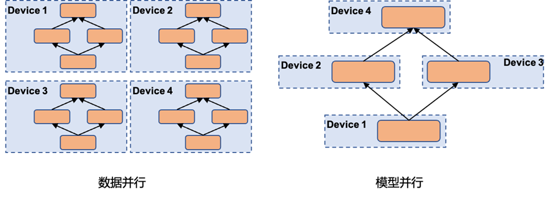
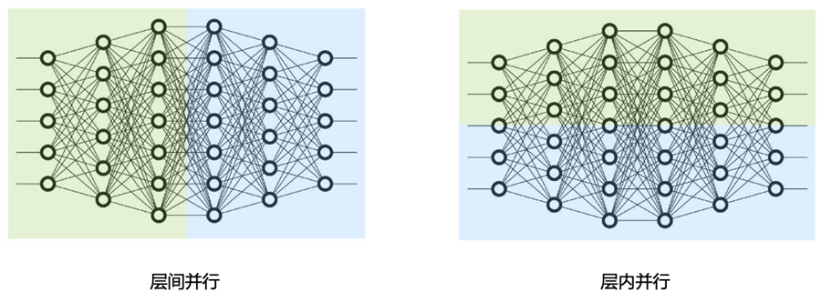
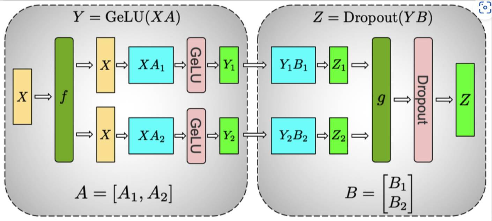
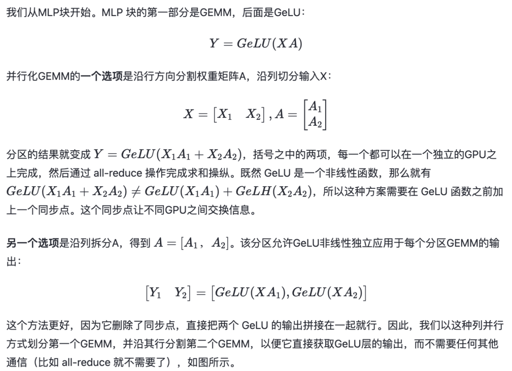
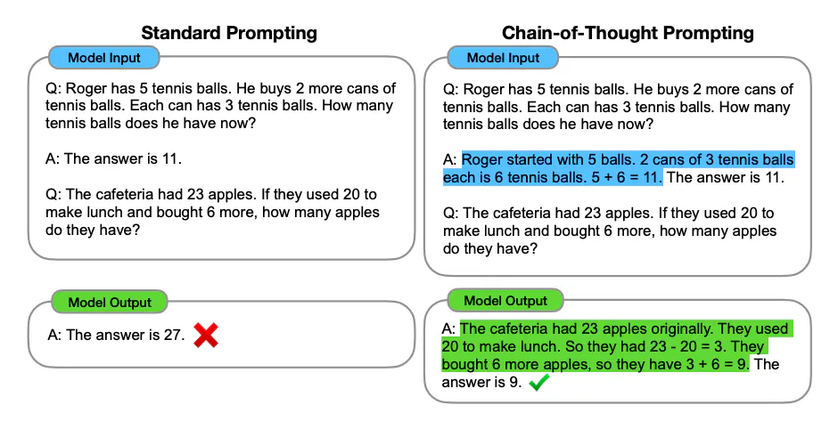
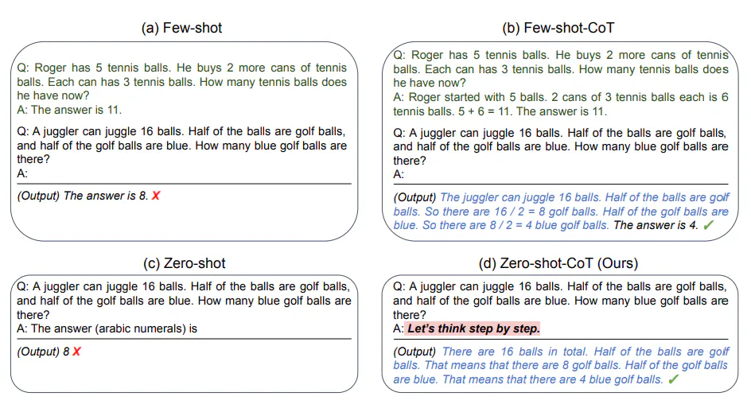
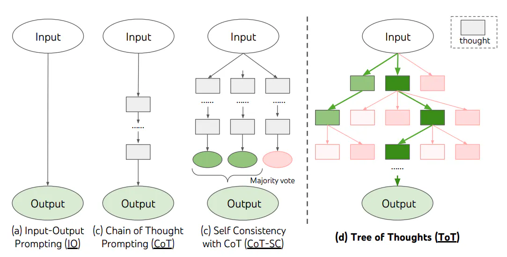

# Awesome-LLM-Learning [](https://github.com/sindresorhus/awesome)
## 引言
欢迎来到本 Repo！这里是一个专注于大语言模型学习的仓库，旨在为大语言模型学习入门者和大语言模型研发岗位的面试准备者提供全面的基础知识。

我们涵盖了多个主题，包括深度学习基础知识、自然语言处理基础知识、大语言模型基础知识以及大语言模型推理和应用等内容。你将在这里找到丰富的学习资料，帮助你构建对大语言模型的全面理解和应用能力。

除了基础知识，我们还会推荐一些大语言模型领域的前沿论文，帮助你跟上最新的研究进展，掌握最先进的技术。

无论你是新手还是有经验的从业者，本 Repo 都会为你提供有价值的学习资源。欢迎一起探索大语言模型的奥秘，让我们一同进步和成长！如果你有任何问题或建议，欢迎提出，我们将尽力完善这个仓库，为大家提供更好的学习体验。谢谢你的参与！
## 目录
- [1.深度学习基础知识](1.深度学习基础知识)
	- [1.Transformer基础](1.深度学习基础知识/1.Transformer基础.md)
	- [2.深度神经网络基础](1.深度学习基础知识/2.深度神经网络基础.md)
- [2.自然语言处理基础知识](2.自然语言处理基础知识)
	- [1.分词器(Tokenizer)](2.自然语言处理基础知识/1.分词器(Tokenizer).md)
	- [2.经典NLP模型](2.自然语言处理基础知识/2.经典NLP模型.md)
	- [3.困惑度(perplexity)](2.自然语言处理基础知识/3.困惑度(perplexity).md)
- [3.大语言模型基础知识](3.大语言模型基础知识)
	- [1.训练框架介绍(Megatron-lm、DeepSpeed)](3.大语言模型基础知识/1.训练框架介绍(Megatron-lm、DeepSpeed).md)
	- [2.参数高效微调(PEFT)](3.大语言模型基础知识/2.参数高效微调(PEFT).md)
	- [3.经典开源LLM介绍](3.大语言模型基础知识/3.经典开源LLM介绍.md)
	- [4.RLHF介绍](3.大语言模型基础知识/4.RLHF介绍.md)
	- [5.CoT、ToT介绍](3.大语言模型基础知识/5.CoT、ToT介绍.md)
	- [6.SFT训练](3.大语言模型基础知识/6.SFT训练.md)
	- [7.混合专家模型(MOE)](3.大语言模型基础知识/7.混合专家模型(MOE).md)
- [4.大语言模型推理](4.大语言模型推理)
	- [1.Huggingface推理参数介绍](4.大语言模型推理/1.Huggingface推理参数介绍.md)
- [5.大语言模型应用](5.大语言模型应用)
	- [1.LangChain介绍](5.大语言模型应用/1.LangChain介绍.md)
- [6.大语言模型前沿分享](6.大语言模型前沿分享)
	- [1.LLM相关博客分享](6.大语言模型前沿分享/1.LLM相关博客分享.md)
	- [2.LLM相关论文分享](6.大语言模型前沿分享/2.LLM相关论文分享.md)
## 深度学习基础知识
### Transformer基础
#### Transformer 的 Self Attention Layer 实现

- Transformer 模型的自注意力（Self Attention）机制涉及三种线性变换：查询（Q）、键（K）、值（V），以及通过计算注意力权重和加权求和来生成最终的输出。以下是自注意力机制的公式：

  - 假设输入序列为 $X \in \mathbb{R}^{L \times d}$，其中 $L$ 是序列长度，$d$ 是特征维度。自注意力层中的线性变换矩阵为 $W_q \in \mathbb{R}^{d \times d_k}$、$W_k \in \mathbb{R}^{d \times d_k}$ 和 $W_v \in \mathbb{R}^{d \times d_v}$，其中 $d_k$ 和 $d_v$ 是分割查询、键和值时的维度。
  - 查询（Q）、键（K）和值（V）的线性变换：

    - $Q=X⋅W_{q}$
    - $K=X⋅W_{k}$
    - $V=X⋅W_{v}$
  - 多头拆分：

    - 在多头自注意力中，将查询（Q）、键（K）和值（V）分成 $h$ 个头，其中 $h$ 是注意力头的数量。对于每个头，使用不同的线性变换权重。
  - 注意力得分计算：

    - 使用查询（Q）和键（K）计算注意力得分，可以使用点积注意力（Scaled Dot-Product Attention）：
      - $Attention(Q,K)=softmax(\frac{QK^{T}}{\sqrt{d_{k}}})$
  - 注意力加权求和：

    - 使用注意力权重对值（V）进行加权求和，得到自注意力的输出：
      - $Output=Attention(Q,K)V$
  - 上述公式涵盖了Transformer模型中自注意力层的基本计算步骤。在实际应用中，通常还会考虑添加缩放（scaling）、掩码（masking）等操作来优化注意力机制的计算过程。多头自注意力则在每个头上分别进行这些计算，然后将多个头的输出拼接或串联起来，进一步提取序列中的信息
- 一个多头 Self Attention 代码实现如下：

```python
import torch
import torch.nn.functional as F

class SelfAttentionLayer(torch.nn.Module):
    def __init__(self, d_model, num_heads):
        super(SelfAttentionLayer, self).__init__()
        self.d_model = d_model
        self.num_heads = num_heads
        self.d_k = d_model // num_heads

        # 线性变换矩阵
        self.W_q = torch.nn.Linear(d_model, d_model, bias=False)
        self.W_k = torch.nn.Linear(d_model, d_model, bias=False)
        self.W_v = torch.nn.Linear(d_model, d_model, bias=False)

    def split_heads(self, x, batch_size):
        x = x.view(batch_size, -1, self.num_heads, self.d_k)
        return x.permute(0, 2, 1, 3)

    def forward(self, x):
        batch_size, seq_len, d_model = x.size()

        q = self.W_q(x)
        k = self.W_k(x)
        v = self.W_v(x)

        q = self.split_heads(q, batch_size)
        k = self.split_heads(k, batch_size)
        v = self.split_heads(v, batch_size)

        # Scaled Dot-Product Attention
        attn_scores = torch.matmul(q, k.transpose(-2, -1)) / (self.d_k ** 0.5)
        attn_weights = F.softmax(attn_scores, dim=-1)

        # Attention加权求和
        output = torch.matmul(attn_weights, v)
        output = output.permute(0, 2, 1, 3).contiguous().view(batch_size, seq_len, -1)

        return output

# 测试自注意力层
d_model = 512
num_heads = 8
seq_len = 10
batch_size = 16

input_data = torch.randn(batch_size, seq_len, d_model)
self_attention = SelfAttentionLayer(d_model, num_heads)
output = self_attention(input_data)
print(output.size())  # 输出: torch.Size([16, 10, 512])
```

#### Transformer 中 Self Attention 计算为什么要除以特征维度数量的平方根

[参考1](https://zhuanlan.zhihu.com/p/366592542), [参考2](https://www.cnblogs.com/hisi-tech/p/16709612.html), [参考3](https://zhuanlan.zhihu.com/p/105722023)

- 上面 Transformer 代码中有使用 $\sqrt{d_{k}}$ 来对 softmax 之后的结果进行 scale，解释如下：

  > We suspect that for large values of $d_{k}$, the dot products grow large in magnitude, pushing the softmax function into regions where it has extremely small gradients. To counteract this effect, we scale the dot products by $\frac{1}{d_{k}}$. To illustrate why the dot products get large, assume that the components of q and k are independent random variables with mean 0 and variance 1. Then their dot product $q ⋅ k=\sum_{i=1}^{d_{k}}(q_{i}k_{i})$, has mean 0 and variance $d_{k}$.
  >

  1. 首先要除以一个数，防止输入 softmax 的值过大，导致偏导数趋近于 0；
  2. 选择根号 d_k 是因为可以使得 q*k 的结果满足期望为 0，方差为 1 的分布，类似于归一化。

#### 为什么要引入位置编码 (Position Embedding)

[参考](https://zhuanlan.zhihu.com/p/106644634)

- 对于任何一门语言，单词在句子中的位置以及排列顺序是非常重要的，它们不仅是一个句子的语法结构的组成部分，更是表达语义的重要概念。一个单词在句子的位置或排列顺序不同，可能整个句子的意思就发生了偏差。

  > I do not like the story of the movie, but I do like the cast.
  > I do like the story of the movie, but I do not like the cast.
  > 上面两句话所使用的的单词完全一样，但是所表达的句意却截然相反。那么，引入词序信息有助于区别这两句话的意思。
  >
- Transformer 模型抛弃了 RNN、CNN 作为序列学习的基本模型。我们知道，循环神经网络本身就是一种顺序结构，天生就包含了词在序列中的位置信息。当抛弃循环神经网络结构，完全采用 Attention 取而代之，这些词序信息就会丢失，模型就没有办法知道每个词在句子中的相对和绝对的位置信息。因此，有必要把词序信号加到词向量上帮助模型学习这些信息，位置编码（Positional Encoding）就是用来解决这种问题的方法。

#### RoPE 位置编码

[参考1](https://zhuanlan.zhihu.com/p/359502624)， [参考2](https://blog.csdn.net/weixin_43646592/article/details/130924280)，[参考3](https://zhuanlan.zhihu.com/p/642289220)

- RoPE
  - 二维情况下用复数表示的 RoPE
    	

 

    根据复数乘法的几何意义，该变换实际上对应着向量的旋转，所以我们称之为“旋转式位置编码”
  - RoPE通过绝对位置编码的方式实现相对位置编码，综合了绝对位置编码和相对位置编码的优点
    - 绝对位置编码：最原始的正余弦位置编码（即sinusoidal位置编码）是一种绝对位置编码，但从其原理中的正余弦的和差化积公式来看，引入的其实也是相对位置编码。
      - 优势： 实现简单，可预先计算好，不用参与训练，速度快
      - 劣势： 没有外推性，即如果预训练最大长度为512的话，那么最多就只能处理长度为512的句子，再长就处理不了了。当然，也可以将超过512的位置向量随机初始化，然后继续微调
    - 相对位置编码：经典相对位置编码RPR式
      - 直接地体现了相对位置信号，效果更好。具有外推性，处理长文本能力更强
  - 主要就是对attention中的q, k向量注入了绝对位置信息，然后用更新的q,k向量做attention中的内积就会引入相对位置信息了

#### Alibi 位置编码

[参考1](https://paperswithcode.com/method/alibi)， [参考2](https://zhuanlan.zhihu.com/p/525552086)， [参考3](https://zhuanlan.zhihu.com/p/642846676)

- ALiBi (Attention with Linear Biases，22年ICLR)，是一种 position embedding 方法，允许 Transformer 语言模型在推理时处理比其训练时更长的序列。
  - ALiBi 在不使用实际位置嵌入的情况下实现这一目标。相反，ALiBi计算某个键和查询之间的注意力时，会根据键和查询的距离来对查询可以分配给键的注意力值进行惩罚。因此，当键和查询靠近时，惩罚非常低，而当它们相距较远时，惩罚非常高。这个方法的动机很简单，即靠近的单词比远离的单词更重要。
    - 不添加position embedding，然后添加一个静态的不学习的 bias
      $softmax(q_{i}K^{T} + m \cdot [-(i-1,...,-2,-1,0)])$
  - ALiBi方法的速度与正弦函数嵌入或绝对嵌入方法相当（这是最快的位置编码方法之一）。在评估超出模型训练序列长度的序列时，ALiBi优于这些方法和Rotary嵌入（这称为外推）方法（ALiBi的方式，训练快了11%，并且会减少11%的内存消耗）。
  - position embedding 并没有加在 work embedding 上，而是加在了 Q*K^T 上面

#### PI 位置插值支持长度外推

[参考](https://zhuanlan.zhihu.com/p/645263524)

- PI位置插值
  - 论文名称：EXTENDING CONTEXT WINDOW OF LARGE LANGUAGE MODELS VIA POSITION INTERPOLATION
  - 论文链接：https://arxiv.org/pdf/2306.1559
  - 方法：位置插值线性向下缩放了输入位置索引以匹配原始的上下文窗口大小，而不是外推超过训练时所用的上下文长度，因为这可能会导致灾难性的较高的注意力分数，从而完全破坏了自注意力机制。
    	

 

    - 左半部分为预训练阶段的位置向量范围[0,2048]
    - 右上角为长度外推的部分(2048,4096]
    - 左下角为位置插值法，将[0,4096]的值降采样到[0,2048]预训练阶段支持的范围
  - 论文的实现很简单，只需要将对应位置缩放到原先支持的区间([0,2048])内：计算公式如下，$L$ 为原先支持的长度(如2048)，$L^{'}$ 为需要扩展的长度(如4096)：
    $f^{'}(x, m)=f(x, \frac{mL}{L^{'}})$

#### NTK-Aware Scaled RoPE 支持长度外推

[参考1](https://www.reddit.com/r/LocalLLaMA/comments/14lz7j5/ntkaware_scaled_rope_allows_llama_models_to_have/), [参考2](https://zhuanlan.zhihu.com/p/645263524)

- 在这项工作中，作者针对当前RoPE插值方法的不足，提出了一种改进方案。通过应用神经切线核（NTK）理论，作者发现现有的线性插值方法在处理距离接近的 token 时存在局限性。因此，作者设计了一种非线性插值方案，以改变 RoPE 的基数。这种方法在保持位置信息完整的同时，有效地提高了上下文大小。实验证明，该方法在没有进行模型微调的情况下就能显著减小困惑度，成为一种非常有效的优化策略。作者相信，通过进一步的微调，这个方法的效果将得到更好的提升。

#### Pre Norm 与 Post Norm 的区别？

参考：[为什么 Pre Norm 的效果不如 Post Norm？](https://kexue.fm/archives/9009)

- 定义：
  - Pre Norm（Norm and add）： $x_{t+1} = x_{t} + F_{t}(Norm(x_{t}))$
  - Post Norm（Add and Norm）： $x_{t+1} = Norm(x_{t} + F_{t}(x_{t})$
- 在同一训练设置下，同一设置之下，Pre Norm 结构往往更容易训练，但最终效果通常不如 Post Norm：
  - Pre Norm 更容易训练好理解，因为它的恒等路径更突出
  - Pre Norm 的深度有“水分”！也就是说，一个L层的Pre Norm模型，其实际等效层数不如 L 层的 Post Norm 模型，而层数少了导致效果变差了。Post Norm 每 Norm 一次就削弱一次恒等分支的权重，所以Post Norm反而是更突出残差分支的，因此 Post Norm 中的层数更加“足秤”，一旦训练好之后效果更优。
- Post Norm 的结构迁移性能更加好，也就是说在 Pretraining 中，Pre Norm 和 Post Norm 都能做到大致相同的结果，但是 Post Norm 的 Finetune 效果明显更好
### 深度神经网络基础
#### Batch Normalization (BN) 和 Layer Normalization (LN) 的区别
[参考1](https://blog.csdn.net/jiyangsb/article/details/124511484)
- Batch Normalization (BN) 与 Layer Normalization (LN) 定义：
  - BN 和 LN 都是通过以下公式进行计算，只是作用的维度不一样，Batch Normalization 是对这批样本的同一维度特征做规范化处理， Layer Normalization 是对这单个样本的所有维度特征做规范化处理
  $y = \frac{x-E(x)}{\sqrt{\text{Var}(x) + \epsilon}} \cdot \gamma + \beta$
  其中 $\gamma$ 和 $\beta$ 是可学习参数
  - 通过以下图片可以对 BN、LN 有更好的理解，其中蓝色元素都放在一起，计算 mean 和 var，带入上式计算，其中 。
  	


- BN 与 LN 区别介绍：
  - 区别：
    - LN中同层神经元输入拥有相同的均值和方差，不同的输入样本有不同的均值和方差；BN中则针对不同神经元输入计算均值和方差，同一个batch中的输入拥有相同的均值和方差
  - 为什么 NLP 使用 LN 而不是 BN？
    - LN 不依赖于 batch 的大小和输入 sequence 的长度，因此可以用于 batchsize 为 1 和 RNN 中 sequence 的 normalize 操作
    - BN 不适用于 batch 中 sequence 长度不一样的情况，有的靠后面的特征的均值和方差不能估算；另外 BN 在 MLP 中的应用对每个特征在 batch 维度求均值方差，比如身高、体重等特征，但是在 NLP 中对应的是每一个单词，但是每个单词表达的特征是不一样的
    - 如果特征依赖于不同样本间的统计参数（比如 CV 领域），那么 BN 更有效(它抹杀了不同特征之间的大小关系，但是保留了不同样本间的大小关系)；NLP 领域 LN 更合适（抹杀了不同样本间的大小关系，但是保留了一个样本内不同特征之间的大小关系），因为对于 NLP 或序列任务来说，一条样本的不同特征其实就是时序上字符取值的变化，样本内的特征关系是非常紧密的
  - 相同点：标准化技术目的是让每一层的分布稳定下来，让后面的层可以在前面层的基础上安心学习，加快模型收敛


#### BN 中的参数量与可学习参数量分析
- 对于一个NCHW（批次大小，通道数，高度，宽度）格式的输入张量，Batch Normalization（BN）层通常包含两组可学习参数：缩放因子（scale）和偏移（shift）。
  - 缩放因子（scale）参数：对于每个通道，都有一个缩放因子参数。因此，缩放因子参数的数量等于通道数（C）。
  - 偏移（shift）参数：同样，对于每个通道，都有一个偏移参数。因此，偏移参数的数量也等于通道数（C）。
  - 均值参数 (mean)：均值参数等于通道数 (C)
  - 方差参数 (var)：方差参数等于通道数 (C)
  - 所以，总共的可学习参数数量等于缩放因子参数和偏移参数的数量之和，即 **2C**。总参数量是 **4C**

- 基于 pytorch 的 BN 示例代码
```python
# CV Example
import torch
import torch.nn as nn
batch, channel, height, width = 20, 100, 35, 45
input = torch.randn(batch, channel, height, width)
m = nn.BatchNorm2d(channel)
output = m(input)
for k, v in m.named_parameters():
  print(k, v.shape)
# -> weight torch.Size([100])
# -> bias torch.Size([100])
```

#### LN 中的可学习参数量分析
- 在 Layer Normalization 中，同样有 scale 和 shift 这两个参数允许模型学习调整输入数据的缩放和偏置，以便更好地适应训练数据的统计分布
- 对于文本数据
  - 输入 tensor size 为 BxSxD，一般只在 D 维度上做归一化计算，计算得到的均值和方差尺寸为 BxSx1，gamma 和 beta 的尺寸为 D，所以可学习参数量为 **2xD**
```python
# NLP Example
import torch
import torch.nn as nn
batch, sentence_length, embedding_dim = 20, 5, 10
embedding = torch.randn(batch, sentence_length, embedding_dim)
layer_norm = nn.LayerNorm(embedding_dim)
output = layer_norm(embedding)
for k, v in layer_norm.named_parameters():
  print(k, v.shape)
# -> weight torch.Size([10])
# -> bias torch.Size([10])
```

- 对于图像数据
  - 输入 tensor size 为 NxCxHxW，一般在 CxHxW 维度上进行归一化计算，计算得到的均值和方差尺寸为 Nx1x1x1，gamma 和 beta 的尺寸为 CxHxW，可学习参数量为 **2xCxHxW**
```python
import torch
import torch.nn as nn

N, C, H, W = 20, 5, 10, 15
input = torch.randn(N, C, H, W)
layer_norm = nn.LayerNorm([C, H, W])
output = layer_norm(input)
for k, v in layer_norm.named_parameters():
  print(k, v.shape)
# -> weight torch.Size([5, 10, 15])
# -> bias torch.Size([5, 10, 15])
```


#### 优化方法:SGD、Adam、AdamW 对比

- SGD优化阶段的梯度参数量等于模型参数量，Adam在保存优化阶段的梯度参数量外还需要保存其它参数，模型的参数量会在优化区间翻 4 倍
- Adam 的参数是【梯度】的一阶矩和二阶矩，跟网络的【激活值】没啥关系
- 参考： [pytorch中常见优化器的SGD,Adagrad,RMSprop,Adam,AdamW的总结](https://zhuanlan.zhihu.com/p/482768895)
  - Adam(Adaptive Moment Estimation)优化算法，整合了RMSprop中的自适应梯度机制和动量梯度机制。
  - AdamW优化器修正了Adam中权重衰减的bug，Decoupled Weight Decay Regularization
    - AdamW与Adam对比，主要是修改了权重衰减计算的方式，一上来直接修改了，而不是把权重衰减放到梯度里，由梯度更新间接缩小
    - 显存/内存消耗等其他细节和Adam没有区别
## 自然语言处理基础知识
### 分词器(Tokenizer)
#### 分词（Tokenize） 介绍
[参考](https://zhuanlan.zhihu.com/p/448147465)
- 语言模型是对文本进行推理。由于文本是字符串，但对模型来说，输入只能是数字，所以就需要将文本转成用数字来表达。最直接的想法，就是类似查字典，构造一个字典，包含文本中所有出现的词汇，比如中文，可以每个字作为词典的一个元素，构成一个列表；一个句子就可以转换成由每个词的编号（词在词典中的序号）组成的数字表达。分词就是将连续的字序列按照一定的规范重新组合成语义独立词序列的过程，一个分词示例流程如下：
  - Hello Geeks how are you 的一句话分开为每个单词为一个 token： [Hello, Geeks, how, are, you]
  - 执行分词的算法模型称为分词器（Tokenizer） ，划分好的一个个词称为 Token，这个过程称为 Tokenization
  - 由于一篇文本的词往往太多了，为了方便算法模型训练，我们会选取出频率 （也可能是其它的权重）最高的若干个词组成一个词表（Vocabulary）

- 古典分词方法
  - 具体分词方式示例
    - 直接把词与词直接加一个空格
    - 按标点符号分词
    - 语法规则分词
  - 缺点
    - 对于未在词表中出现的词（Out Of Vocabulary, OOV ），模型将无法处理（未知符号标记为 [UNK]）。
    - 词表中的低频词/稀疏词在模型训无法得到训练（因为词表大小有限，太大的话会影响效率）
    - 很多语言难以用空格进行分词，例如英语单词的多形态，"look"衍生出的"looks", "looking", "looked"，其实都是一个意思，但是在词表中却被当作不同的词处理，模型也无法通过 old, older, oldest 之间的关系学到 smart, smarter, smartest 之间的关系。这一方面增加了训练冗余，另一方面也造成了大词汇量问题。

- 拆分为单个字符（Character embedding）
  - 是一种更为极端的分词方法，直接把一个词分成一个一个的字母和特殊符号。虽然能解决 OOV 问题，也避免了大词汇量问题，但缺点也太明显了，粒度太细，训练花费的成本太高

- 基于子词的分词方法（Subword Tokenization）
  - 把一个词切成更小的一块一块的子词，**基于子词的分词方法是目前主流的分词方案**，有点类似英语中的词根词缀拼词法，其中的这些小片段又可以用来构造其他词。可见这样做，既可以降低词表的大小，同时对相近词也能更好地处理
    - 例如：“unfortunately ” = “un ” + “for ” + “tun ” + “ate ” + “ly ”
  - 三种主流的 Subword 算法，它们分别是：Byte Pair Encoding (BPE)、WordPiece 和 Unigram Language Model

#### 字节对编码 Byte Pair Encoding (BPE)、WordPiece、Unigram Language Model 介绍
[参考1](https://zhuanlan.zhihu.com/p/448147465), [参考2](https://zhuanlan.zhihu.com/p/86965595)
- 字节对编码（BPE, Byte Pair Encoder），又称 digram coding 双字母组合编码，是一种数据压缩 算法，用来在固定大小的词表中实现可变⻓度的子词。该算法简单有效，因而目前它是最流行的方法。
  - BPE 首先将词分成单个字符，然后依次用另一个字符替换频率最高的一对字符 ，直到循环次数结束。
  - 算法过程
    1. 准备语料库，确定期望的 subword 词表大小等参数
    2. 通常在每个单词末尾添加后缀 </w>，统计每个单词出现的频率，例如，low 的频率为 5，那么我们将其改写为 "l o w </ w>”：5
    注：停止符 </w> 的意义在于标明 subword 是词后缀。举例来说：st 不加 </w> 可以出现在词首，如 st ar；加了 </w> 表明该子词位于词尾，如 we st</w>，二者意义截然不同
    3. 将语料库中所有单词拆分为单个字符，用所有单个字符建立最初的词典，并统计每个字符的频率，本阶段的 subword 的粒度是字符
    4. 挑出频次最高的符号对 ，比如说 t 和 h 组成的 th，将新字符加入词表，然后将语料中所有该字符对融合（merge），即所有 t 和 h 都变为 th。
    注：新字符依然可以参与后续的 merge，有点类似哈夫曼树，BPE 实际上就是一种贪心算法 。
    5. 重复遍历 2 和 3 操作，直到词表中单词数达到设定量 或下一个最高频数为 1 ，如果已经打到设定量，其余的词汇直接丢弃
  - BPE 一般适用在欧美语言拉丁语系中，因为欧美语言大多是字符形式，涉及前缀、后缀的单词比较多。而中文的汉字一般不用 BPE 进行编码，因为中文是字无法进行拆分。对中文的处理通常只有分词和分字两种。理论上分词效果更好，更好的区别语义。分字效率高、简洁，因为常用的字不过 3000 字，词表更加简短。

- WordPiece：WordPiece算法和BPE类似，区别在于WordPiece是基于概率生成新的subword而不是下一最高频字节对。- Unigram：它和 BPE 等一个不同就是，bpe是初始化一个小词表，然后一个个增加到限定的词汇量，而 Unigram 是先初始一个大词表，接着通过语言模型评估不断减少词表，直到限定词汇量。


#### ChatGPT 的 tokenizer 用于中文分词的问题
[参考](https://zhuanlan.zhihu.com/p/626621158)

- 在 [Openai Tokenizer demo](https://platform.openai.com/tokenizer) 中，中文分词后的 token 数量远大于原始中文字符数目
	

 

- 原因剖析：OpenAI 为了支持多种语言的 Tokenizer，采用了文本的一种通用表示：UTF-8 的编码方式，这是一种针对 Unicode 的可变长度字符编码方式，它将一个 Unicode 字符编码为1到4个字节的序列。


#### 为什么 llama 的 tokenizer 需要单独针对中文语料进行词表扩充
- 百川2的技术报告中提到过 tokenizer 的设计需要考虑两个重要因素：
  - 高压缩率：以实现高效的推理
  - 适当大小的词汇表：以确保每个词嵌入的充分训练
- 因为原生LLaMA对中文的支持很弱，tokenizer 中的中文字符和词汇较少，导致一个中文汉字往往被切分为多个 token，不满足上面所提到的高压缩率原则，所以需要进行词表扩充
### 经典NLP模型
#### Bert

- Bert的预训练主要包含两个任务，MLM和NSP，Masked Language Model任务可以理解为完形填空，随机mask每一个句子中15%的词，用其上下文来做预测；Next Sentence Prediction任务选择一些句子对A与B，其中50%的数据B是A的下一条句子，剩余50%的数据B是语料库中随机选择的，学习其中的相关性。BERT 预训练阶段实际上是将上述两个任务结合起来，同时进行，然后将所有的 Loss 相加
### 困惑度(perplexity)
#### 困惑度 (perplexity) 介绍
[参考1](https://paddlepedia.readthedocs.io/en/latest/tutorials/deep_learning/metrics/perplexity.html)，[参考2](https://zhuanlan.zhihu.com/p/44107044), [参考3](https://zhuanlan.zhihu.com/p/114432097)

- 困惑度定义
  - Perplexity，中文翻译为困惑度，是信息论中的一个概念，其可以用来衡量一个随机变量的不确定性，也可以用来衡量模型训练的好坏程度。通常情况下，一个随机变量的Perplexity数值越高，代表其不确定性也越高；一个模型推理时的Perplexity数值越高，代表模型表现越差，反之亦然。
- 计算方式：
  - 对于句子s（词语w的序列）
  $S = W_{1}, W_{2},...,W_{k}$
  - 它的概率为 $P(S) = P(W_{1}, W_{2}, ..., W_{k}) = p(W_{1})P(W_{2}|W_{1})...P(W_{k}|W_{1},W_{2},...,W_{k-1})$
  - 困惑度与测试集上的句子概率相关，其基本思想是：给测试集的句子赋予较高概率值的语言模型较好,当语言模型训练完之后，测试集中的句子都是正常的句子，那么训练好的模型就是在测试集上的概率越高越好，公式如下:
  $Perplexity(W)=P(w_{1}w_{2}...w_{N})^{-\frac{1}{N}}=\sqrt[N]{\frac{1}{P(w_{1}w_{2}...w_{N})}}$
  - 从上面公式可以分析得到：句子越好（概率大），困惑度越小，也就是模型对句子越不困惑。
- 语言模型中的使用：perplexity可以从cross entropy中得到，而cross entropy又是除了语言模型以外的文本生成任务（如机器翻译，摘要生成等）也常用的loss，所以我们也可以把perplexity拓展到语言模型外，用cross entropy来计算文本生成里的困惑度。机器翻译的框架OpenNMT就使用了困惑度作为一个指标：
  	


## 大语言模型基础知识
### 训练框架介绍(Megatron-lm、DeepSpeed)
#### Megatron-lm 介绍

[参考1](https://arxiv.org/abs/1909.08053), [参考2](https://www.bilibili.com/video/BV1nB4y1R7Yz/?spm_id_from=333.880.my_history.page.click&vd_source=4485ae5d861b0e733e8796b93c824c9e), [参考3](https://huggingface.co/blog/zh/megatron-training), [参考4](https://blog.csdn.net/zwqjoy/article/details/132507636), [参考5](https://www.paddlepaddle.org.cn/support/news?action=detail&id=2913)

- NVIDIA 出品的 Megatron-LM 是一个基于 PyTorch 的分布式训练框架，用来训练基于 Transformer 的大型语言模型。Megatron-LM 综合应用了数据并行（Data Parallelism），张量并行（Tensor Parallelism）和流水线并行（Pipeline Parallelism）来复现 GPT-3.

- 【背景】
  - 随着计算资源的普及和数据集的增大，模型参数的数量呈指数级增长。然而，训练这样规模庞大的模型面临着一些挑战：
    - **显存限制**： 即便是目前最大的GPU主内存也难以容纳这些模型的参数。举例来说，一个1750亿参数的GPT-3模型需要约700GB的参数空间，对应的梯度约为700GB，而优化器状态还需额外的1400GB，总计需求高达2.8TB。
    - **计算挑战**： 即使我们设法将模型适应单个GPU（例如通过在主机内存和设备内存之间进行参数交换），模型所需的大量计算操作也会导致训练时间大幅延长。举个例子，使用一块NVIDIA V100 GPU来训练拥有1750亿参数的GPT-3模型，大约需要耗时288年。
    - **并行策略挑战**： 不同的并行策略对应不同的通信模式和通信量，这也是一个需要考虑的挑战。

- 并行策略介绍：其中张量并行和流水线并行属于模型并行范畴
  - **数据并行 (DP)**: 数据并行模式会在每个worker之上复制一份模型，这样每个worker都有一个完整模型的副本。输入数据集是分片的，一个训练的小批量数据将在多个worker之间分割；worker定期汇总它们的梯度，以确保所有worker看到一个一致的权重版本
  - **张量并行 (TP)**: 把某一个层做切分，放置到不同设备之上，也可以理解为把矩阵运算分配到不同的设备之上，比如把某个矩阵乘法切分成为多个矩阵乘法放到不同设备之上。
  - **流水线并行 (PP)**: 把模型不同的层放到不同设备之上，比如前面几层放到一个设备之上，中间几层放到另外一个设备上，最后几层放到第三个设备之上。






#### TP 和 PP 通信对比
[参考](https://blog.csdn.net/zwqjoy/article/details/132507636)
- 通信方式：
  - 流水线并行 (PP)：通信在流水线阶段相邻的切分点之上，通信类型是P2P通信，单次通信数据量较少但是比较频繁，而且因为流水线的特点，会产生GPU空闲时间，这里称为流水线气泡（Bubble）
  - 张量并行 (TP)：通信发生在每层的前向传播和后向传播过程之中，通信类型是 all-reduce，不但单次通信数据量大，并且通信频繁。
- 通信设备：张量并行一般都在同一个机器之上，所以通过 NVLink 来进行加速，对于流水线并行，一般通过 Infiniband 交换机进行连接。

#### MLP 的切分为什么 A 采用列切割，B采用行切割？
[参考](https://blog.csdn.net/zwqjoy/article/details/132507636)







#### DDP 具体原理介绍, Ring-AllReduce 原理？
[参考1](https://zhuanlan.zhihu.com/p/617133971), [参考2](https://zhuanlan.zhihu.com/p/504957661)
- 分布式数据并行，采用Ring AllReduce的通讯方式，实际中多用于多机场景
  - 受通讯负载不均的影响，DP一般用于单机多卡场景。因此，DDP作为一种更通用的解决方案出现了，既能多机，也能单机。DDP首先要解决的就是通讯问题：将Server上的通讯压力均衡转到各个Worker上。实现这一点后，可以进一步去Server，留Worker。
  - Ring-AllReduce 通过定义网络环拓扑的方式，将通讯压力均衡地分到每个GPU上，使得跨机器的数据并行（DDP）得以高效实现。
    - 实现分为两个步骤: Reduce-Scatter和All-Gather
  - DP和DDP的总通讯量相同，但因负载不均的原因，DP需要耗费更多的时间搬运数据

#### DeepSpeed 介绍
[参考](https://zhuanlan.zhihu.com/p/513571706)

- DeepSpeed的核心是ZeRO(Zero Redundancy Optimizer)，简单来说，它是一种显存优化的数据并行(data parallelism, DP)方案。在过去两年DeepSpeed团队发表了三篇ZeRO相关的论文，提出了去除冗余参数、引入CPU和内存、引入NVMe等方法，从始至终都围绕着一个目标：将显存优化进行到底。

- ZeRO将模型训练阶段，每张卡中显存内容分为两类：
  - 模型状态（model states）: 模型参数（fp16）、模型梯度（fp16）和Adam状态（fp32的模型参数备份，fp32的momentum和fp32的variance）。假设模型参数量
 $\Phi$， 则共需要 $2\Phi+2\Phi+(4\Phi+4\Phi+4\Phi)=16\Phi$ 字节存储，可以看到，Adam 状态占比 75%。
  - 剩余状态（residual states）: 除了模型状态之外的显存占用，包括激活值（activation）、各种临时缓冲区（buffer）以及无法使用的显存碎片（fragmentation）。
  - 来看一个例子，GPT-2含有1.5B个参数，如果用fp16格式，只需要3GB显存，但是模型状态实际上需要耗费24GB！
### 参数高效微调(PEFT)
#### Pattern-Exploiting Training（PET）
[参考](https://mp.weixin.qq.com/s?__biz=MzIwMTc4ODE0Mw%3D%3D&chksm=96ea6fe7a19de6f1be86b965e268df1b9c6320810cf32b6d64ddd3d238bf9088be41fb36adfe&idx=1&mid=2247512167&scene=21&sn=cc7695d92362e3b18a6e8969fb14dc27#wechat_redirect)
- 它通过人工构建的模版与 BERT 的 MLM 模型结合，能够起到非常好的零样本、小样本乃至半监督学习效果，而且该思路比较优雅漂亮，因为它将预训练任务和下游任务统一起来了

#### P-tuning
[参考1](https://arxiv.org/pdf/2103.10385.pdf), [参考2](https://blog.csdn.net/c9Yv2cf9I06K2A9E/article/details/115648821)
- P-tuning（GPT Understands, Too）
  - P-tuning 重新审视了关于模版的定义，放弃了“模版由自然语言构成”这一常规要求，从而将模版的构建转化为连续参数优化问题，虽然简单，但却有效
  - P-tuning直接使用[unused*]的token来构建模版，不关心模版的自然语言性


#### LoRA

[参考1](https://zhuanlan.zhihu.com/p/617211910)，[参考2](https://zhuanlan.zhihu.com/p/643560888#:~:text=%E4%BB%BB%E5%8A%A1%E4%B8%AD%E7%9A%84%E6%8C%91%E6%88%98-,7.Lora%E7%9A%84%E5%8E%9F%E7%90%86%E5%92%8C%E5%AD%98%E5%9C%A8%E7%9A%84%E9%97%AE%E9%A2%98%E8%AE%B2%E4%B8%80%E4%B8%8B%EF%BC%9F,-%E5%89%8D%E9%9D%A2%E5%9C%A84)
- 低秩自适应 (Low-Rank Adaptation, LoRA)：冻结了预训练的模型权重，并将可训练的秩分解矩阵注入到 Transformer 架构的每一层，极大地减少了下游任务的可训练参数的数量，有效提升预训练模型在下游任务上的 finetune 效率


- 【背景】之前的 PEFT 方法是 adapter/prefix/promp/P-tuning，但是Adapter会引入很强的推理延迟（只能串行），prefix/prompt/P-tuning很难练，而且要占用context length，变相的降低模型能力
- 【详解】具体来说，就是考虑到语言模型（LLM 尤其如此）的参数的低秩属性（low intrinsic dimension），或者说过参数化，在做 finetune 的时候不做 full-finetune，而是用一个降维矩阵A和一个升维矩阵B去做finetune。如果我们认为原来的模型的某个参数矩阵为  $W_{0}$，那么可以认为原来经过全微调的参数矩阵为 $W_{0} + \Delta(W)$ ，但考虑到前面的低秩属性，在 lora 中我们可以简单认为  $\Delta(W)=BA$  (B 是降维矩阵，A是升维矩阵，其中 A 正常随机数初始化，**B 全 0 初始化**，从而保证训练初期的稳定性)，其中 BA 的秩相当于是你认为的模型实际的秩。这样的话在做推理的时候， $h=W_{0}x + BAx$ ，根本不会引入推理延迟，因为你只需要把训好的 lora 参数 $AB$ 加进模型初始权重 $W_{0}$ 中就可以了。在 Transformer 中 self-attention 和 mlp 模块都有对应的 params 矩阵，对应加上 lora 即可。
  - llama 为了节省参数量一般只加在 q、v 上 ([参考](https://github.com/tloen/alpaca-lora/blob/main/finetune.py#L44))，原论文实验是不会掉点
  - bloom 一般加在 q、k、v 上
### 经典开源LLM介绍
#### Llama
- causal LM： 严格遵守只有后面的token才能看到前面的token的规则
- 使用 RoPE 位置编码

#### Llama2
[参考](https://zhuanlan.zhihu.com/p/645381497)

- 开发并发布了 Llama 2，包含预训练的大语言模型和微调大语言模型，模型规模有 7b、13b、70b 这三种（还有个没有开源的 34b 版本）
  - 预训练语料增加了 40%
  - context length 从 2048 提升到 4096
  - 70b模型使用了 grouped-query attention （GQA）
  - 提供了微调版本的 LLM，称为 Llama 2-Chat，针对对话用例进行了优化
  - Llama2 在大多数基准测试中都优于开源聊天模型，并且基于有用性和安全性方向进行人工评估，期望称为封闭源模型（chatgpt等）的合适替代品
  - 提供了对 Llama 2-Chat 微调和安全改进的方法的详细描述，为开源社区做出贡

#### ChatGLM and ChatGLM2
- ChatGLM
  - 使用 prefix LM：prefix部分的token互相能看到
  - 使用 RoPE 位置编码
- ChatGLM2
  - 回归 decoder-only 结构，使用 Causal LM
  - 使用 RoPE 位置编码

#### Bloom
[参考](https://zhuanlan.zhihu.com/p/617608656)
- 176B 参数，decoder only
- BLOOM 使用 Alibi 位置编码
- ROOTS语料库上训练，该数据集包括46种自然语言和13种编程语言（共59种）的数百个来源


#### InternLM-XComposer
[参考](https://zhuanlan.zhihu.com/p/661465576)
- 提出了视觉语言大模型 InternLM-XComposer，具有高级的文本图像理解和组合能力
  - **交错式文本-图像组合**：InternLM-XComposer 擅长生成与上下文相关图像交错的长篇内容，从而提升了视觉-语言交互的体验。
    - 首先根据人工提供的指令创建文本
    - 随后，它自动确定文本中最适合放置图像的位置，并提供相应的合适的图像描述。根据生成的描述，与依赖于文本-图像生成模型来帮助的方法不同，我们选择从大规模网络爬取的图像数据库中获取对齐的图像，以实现更真实的质量和上下文对齐。此外，它还提供了灵活性，允许用户自定义图像库。
      - 与仅依赖于 CLIP 进行图像检索的基线方法相比，XComposer 提供了更可靠的选择最合适图像的解决方案。首先，使用 CLIP 从数据库中选择潜在的图像候选项。然后，InternLM-XComposer 利用其理解能力来识别最适合内容的图像
  - **具有丰富多语言知识的理解**。LLM 在处理开放世界任务方面表现出了出色的通用性，这一能力归因于其广泛的训练数据，例如 LLaMA2 中使用的 2T token 训练。这一庞大数据集囊括了多个领域的广泛语义知识。相比之下，现有的视觉-语言数据集在容量和多样性方面相对受限。为了解决这些限制，我们采用了两种实际解决方案：
    - 首先，从公共网站收集了一个包含超过 1100 万个语义概念的交错多语言视觉-语言数据集
    - 其次，在训练流程中精心制定了预训练和微调策略，采用了主要是英文和中文的纯文本和图像-文本混合训练数据。因此，InternLM-XComposer 在理解各种图像内容和提供广泛的多语知识方面表现出了出色的能力。
- 所提出的 InternLM-XComposer 在文本-图像理解和组合方面表现出卓越的能力。它在各种领先的视觉-语言大型模型的基准测试中取得 SOTA 的成绩，包括英文的 MME 基准测试、MMBench、Seed-Bench 以及中文的 MMBench-CN 和 CCBench（中国文化基准测试）的评估。值得注意的是，我们的方法在中文语言的基准测试中，即MMBench-CN 和 CCBench 上显著优于现有框架，展示出卓越的多语知识能力。
	


#### CODEFUSION
- 提出了 CODEFUSION，一个自然语言到代码（NL-to-code）的生成模型
  - 它结合了编码器-解码器架构（Raffel et al., 2020）与扩散过程。编码器将自然语言映射为连续表示，扩散模型使用这一表示作为额外条件来去噪随机高斯噪声输入。为了生成语法正确的代码，我们随后将去噪后的嵌入输入到 transformer 解码器，通过完整的自注意力和与嵌入话语的交叉注意力，获得代码 token 的概率分布。最后，我们在每个索引选择最高概率的 token。
  - 为了预训练 CODEFUSION 进行代码生成，我们将连续段落去噪（CPD）任务扩展到代码领域。具体来说，我们只对代码中对应于标识符或目标语言内置关键词的 token 应用噪声。这个去噪任务使模型能够学习关键代码 token（如变量名、函数名和控制流内置函数）之间的关系。
  - 我们发现，与自回归模型相比，CODEFUSION 产生了更多样化的代码（n-gram 比例更高，嵌入相似性更低，编辑距离更高）。CPD 目标，它使模型偏向于学习以语境感知的方式去除噪声，并配以能够访问完整去噪表示的解码器，共同使 CODEFUSION 在与 GENIE 比较时（一个文本扩散模型），生成了 48.5% 更多语法正确的代码（平均跨三种语言）。我们在三种不同语言的自然语言到代码上评估 CODEFUSION：Python，Bash 和 Microsoft Excel 中的条件格式化规则。我们的结果表明，CODEFUSION的（7500万参数）top-1 结果与更大的最新系统（3.5亿–1750亿参数）相当或更好。在 top-3 和 top-5 中，CODEFUSION 的表现优于所有基线。
  	


#### baichuan2
[参考](https://zhuanlan.zhihu.com/p/657487567)
- 本文提出了 Baichuan2
  - 提出 baichuan2-7b 和 baichuan2-13b，这两个模型都是在2.6万亿令牌上进行训练的，比 Baichuan 1 的数据集大了一倍多。
    - 在像 MMLU、CMMLU 和 C-Eval 等一般基准上，Baichuan 2-7B 的性能比 Baichuan 1-7B 提高了近 30%。具体来说，Baichuan 2 优化了数学和代码问题的性能
      - GSM8K 和 humaneval 几乎涨点一倍
      - 在医疗和法律上也有提升，比如 MedQA 和 JEC-QA 数据集
  - 提出 Baichuan 2-7B-Chat 和 Baichuan 2-13B-Chat，经过微调后的对话模型
  - 为了推动研究合作和持续改进，还发布了 Baichuan 2 在各个训练阶段的检查点，从 2000 亿 token 到完整的 2.6 万亿 token
  - 分享一些通过训练 Baichuan 2 获得的试验、错误和经验教训

#### Code Llama
[参考](https://zhuanlan.zhihu.com/p/657487373)

- 发布了 Code Llama，基于 Llama 2 的一系列大型代码语言模型，提供了在开放模型中的最先进性能、填充能力、支持大输入上下文以及零-shot编程任务指令跟随能力。
  - 提供多个版本以涵盖各种应用：
    - 基础模型（Code Llama）
    - Python 专业化版本（Code Llama - Python）
    - 指令跟随模型（Code Llama - Instruct）
  - 每个版本分别具有 7B、13B 和 34B 参数，所有模型都是在 16k token 序列上训练的，并在最多包含 100k token 的输入上进行长序列改进。
  - 7B 和 13B 的 Code Llama 以及 Code Llama - Instruct 变种支持基于周围内容的填充。
  - Code Llama 在多个代码基准测试中达到了开放模型中的最先进性能，分别在 HumanEval 和 MBPP 上取得了高达 53% 和 55% 的分数（优于 Llama2 70B），MultiPL-E 上精度优于所有开源模型
  - 重点是和 Llama2 开源协议一样，Code Llama 开源并允许进行研究和商业用途
- code llama 各系列模型训练流程如下：
	


### RLHF介绍
#### PPO (Proximal Policy Optimization) 介绍
[参考1](https://huggingface.co/blog/deep-rl-ppo), [参考2](https://zhuanlan.zhihu.com/p/645225982)

- 大语言模型 RLHF 中的 PPO 分成三部分：采样、反馈和学习
  - 采样就是学生回答问题的过程，是模型根据提示（prompt）输出回答（response）的过程，或者说是模型自行生产训练数据的过程
    - 策略（policy），它就是RLHF中的“学生”。policy由两个模型组成，一个叫做演员模型（Actor），另一个叫做评论家模型（Critic）。它们就像是学生大脑中的两种意识，一个负责决策，一个负责总结得失。其中演员就是我们想要训练出来的大模型。在用PPO训练它之前，它就是RLHF的第一步训练出来的SFT（Supervised Fine-Tuning）model。
  - 反馈就是老师检查答案的过程，是奖励模型（Reward Model）给response打分的过程，或者说是奖励模型给训练数据X标上Y值的过程
    - 给予最终奖励之前，最好也对它的“标新立异”给予少量的惩罚。实现方式是让 old_log_prob 的 token 概率分布尽量接近 ref_log_prob。通俗来说，整个reward function的计算逻辑是典型的霸总逻辑：除非你能拿到好的结果，否则你就得给我守规矩。
  - “学习“就是学生根据反馈总结得失并自我改进的过程，或者说是强化优势动作的过程。
    - 优势定义为“实际获得的收益超出预期的程度”。PPO计算优势的方法：优势 = 实际收益 - 预期收益。
    - 所谓“强化优势动作”，即强化那些展现出显著优势的动作。

#### DPO (Direct Preference Optimization) 介绍
[参考1](https://arxiv.org/pdf/2305.18290.pdf)，[参考2](https://zhuanlan.zhihu.com/p/636122434)
- 背景
  - 目前常用人类对模型生成数据的反馈来进一步训练LM，对齐人类偏好；RLHF是其中的代表工作，先通过训练一个反映人类对生成回答偏好的reward model（RW），再通过强化学习（PPO）来最大化预测的回报（reward），同时，施加KL限制（constraints）避免模型偏离太远。
  -这个 pipeline 比较复杂，需要先训练一个reward model 得到回报分数，再通过 PPO 强化学习最大化 reward 更新策略（模型参数），其中的 PPO 阶段，需要多个模型（actor&ref model& critic model& reward model），特别耗显存，并且在训练过程中，需要对策略进行采样，计算量巨大


- DPO 实现方式


  - 直接优化 LM 来对齐人类偏好，无需建模 reward model 和强化学习阶段。基于 RL 的目标函数可以通过优化二分 cross entropy 目标来优化
  - DPO loss 表达为如下形式


  其中 $y_w$ 的被人类喜好程度大于 $y_l$，DPO loss 的梯度如下


  可以看出该 loss 的作用主要是增加喜好数据的 likelihood，降低非喜好数据的 likelihood，同时会基于隐私 reward 估计的错误程度进行加权。本文的实验表明了这种加权的重要性，因为没有加权系数的这种方法的简单版本可能会导致语言模型退化
### CoT、ToT介绍
#### 思维链 CoT (Chain-of-Thought) 介绍
[参考](https://www.promptingguide.ai/techniques/cot)
- 以下样例可以发现对于一些需要推理的问题，比如数学题，模型如果使用更多的中间推理步骤能实现复杂的推理能力，比如左边直接回答问题的结果是错的，但是如果一步一步思考就能做对。





- 通过 zero-shot 的 prompting 进行 COT，最经典的方式是使用 google 提出来的 `Let's think step by step"`





#### 思维树 （Tree of Thoughts，ToT） 介绍
[参考1](https://www.promptingguide.ai/zh/techniques/tot), [参考2](https://arxiv.org/abs/2305.10601)

- ToT 基于思维链提示进行了总结，引导语言模型探索把思维作为中间步骤来解决通用问题。ToT 维护着一棵思维树，思维由连贯的语言序列表示，这个序列就是解决问题的中间步骤。使用这种方法，LM 能够自己对严谨推理过程的中间思维进行评估。LM 将生成及评估思维的能力与搜索算法（如广度优先搜索和深度优先搜索）相结合，在系统性探索思维的时候可以向前验证和回溯。





- ToT 需要针对不同的任务定义思维/步骤的数量以及每步的候选项数量。例如，论文中的“算 24 游戏”是一种数学推理任务，需要分成 3 个思维步骤，每一步都需要一个中间方程。而每个步骤保留最优的（best） 5 个候选项。ToT 完成算 24 的游戏任务要执行广度优先搜索（BFS），每步思维的候选项都要求 LM 给出能否得到 24 的评估：“sure/maybe/impossible”（一定能/可能/不可能） 。作者讲到：“目的是得到经过少量向前尝试就可以验证正确（sure）的局部解，基于‘太大/太小’的常识消除那些不可能（impossible）的局部解，其余的局部解作为‘maybe’保留。”每步思维都要抽样得到 3 个评估结果。整个过程如下图所示：


### SFT训练
#### SFT 训练如何提升训练效率
- 数据去重降低重复数据带来的计算量：基于正则匹配，minhash 等算法
- 训练语料中多条 concat 为一条，使不同 batch 的语料 token 数目基本一致，从而降低 padding 对计算效率的影响
- 使用 bf16 数值类型代替 fp32 数值类型
- 测试训练效率最高的 DP/TP/PP 参数
- freeze transformer 模型的底层参数

#### 多轮对话数据如何计算损失
[参考](https://zhuanlan.zhihu.com/p/647733151)
- ChatGLM2的多轮对话训练方式如下图所示，只有最后一轮对话内容参与计算loss，其他的Assistant回复内容不参与计算loss，训练数据利用不充分，造成浪费。


- ChatGLM2 多轮训练优化方式如下，训练时，多轮对话中的每个回复都被充分利用。：


### 混合专家模型(MOE)
#### 混合专家模型 (Mixture of Experts, MOE) 是什么
[参考1](https://www.tensorops.ai/post/what-is-mixture-of-experts-llm), [参考2](https://zhuanlan.zhihu.com/p/674698482), [参考3](https://arxiv.org/pdf/1701.06538.pdf)

- 谷歌 2017 年在自然语言处理首次应用的混合专家模型（Mixture of Experts，简称MoE）是一种先进的神经网络架构，它通过混合多个专家模型来提升 LLM 性能。在 MoE 中，每个专家模型都专注于特定的子任务或领域。例如，一个专家模型可以擅长生成文本，另一个专家模型可以擅长回答问题。当需要完成某个任务时，MoE 会根据任务的类型选择合适的专家模型来执行。
- 然而，需要澄清的是，尽管使用了 “专家” 一词，但这些 LLM 模型并不像我们通常认为的科学或艺术领域的人类专家那样具有专业知识。它们的 “专业知识” 存在于一个复杂的高维嵌入空间中。

#### MOE 实现原理
[参考1](https://arxiv.org/pdf/1701.06538.pdf), [参考2](https://medium.com/@sthanikamsanthosh1994/the-mixer-of-experts-moe-modern-architecture-for-divide-and-concur-learning-dbe10ffa8436), [参考3](https://zhuanlan.zhihu.com/p/672025580)

- 如下图所示，MOE 模型包含两个核心组件： Gating Network 和 Expert。
  - Gating Network：通过 Gating Network 来选择具体要使用的专家模型。Gating Network 一般是通过 softmax 门控函数通过专家或 token 对概率分布进行建模，并选择前 K 个。例如，如果模型有三个专家，输出的概率可能为 0.5 和 0.4、0.1，这意味着第一个专家对处理此数据的贡献为 50%，第二个专家为 40%，第二个专家为 10%，这个时候的 K 就可以选择为 2，我们认为前两个专家模型的建议会更好，可以用于更加精确的回答中，而第三个专家模型的建议可以用于更加富有创意性的答案中。
  - Expert：在训练的过程中，输入的数据被门控模型分配到不同的专家模型中进行处理；在推理的过程中，被门控选择的专家会针对输入的数据，产生相应的输出。这些输出最后会和每个专家模型处理该特征的能力分配的权重进行加权组合，形成最终的预测结果。


- MOE 代码实现：[MOE 代码示例](https://www.zhihu.com/tardis/zm/art/673048264?source_id=1003)


#### MOE 优缺点
[参考](https://www.tensorops.ai/post/what-is-mixture-of-experts-llm)

MoE 的优势：速度与效率

- 预训练速度：由于具有稀疏层，它们的预训练速度比密集模型快得多。

- 推理速度：尽管规模较大，但它们提供更快的推理速度，在任何给定时间内仅使用其参数的一小部分。

- 低成本：与具有相同总参数数量的密集模型相比，由于前两点，MoE 模型在训练和推理上要便宜得多。

- 回答质量：通过为不同主题使用专家，它创建了一个表现更好的整体模型。能够记住更多信息并解决更多的特定场景。

MoE 的缺点：GPU 需求和难以训练

- GPU VRAM 需求：一个问题是它们对 VRAM 的高需求，因为所有专家都需要加载到内存中，即使在某个特定时间只使用了 1 或 2 个。

- 微调困难：历史上，MoEs 在微调方面存在困难，经常导致过拟合。尽管现在在这方面已经取得了许多进展，并且变得更容易。

- 训练和推理的权衡：尽管提供了更快的推理，但它们需要对 VRAM 和计算资源进行谨慎管理。


#### GPT4 的 MOE 架构
[参考](https://www.tensorops.ai/post/what-is-mixture-of-experts-llm)
- GPT4 是 MOE 架构主要来源于小道消息，OpenAI 官方未确认过。自动驾驶初创公司 Comma.ai 的创始人乔治·霍茨透露，GPT-4 不是一个庞大的单一模型，而是由 8 个较小的模型组合而成，每个模型包含 2200 亿个参数。后来，Meta 的 PyTorch 共同创始人 Soumith Chintala 证实了这一泄露消息。
- GPT4 -> 8 x 220B 参数 = 1.7T 参数
GPT-3.5 大约有 175B 参数。然而，当使用 MoE 时，计算总参数数量并不那么直接，因为只有 FFN（前馈网络）层在每个专家之间是独立的，而其他层可以由所有专家共享。这可能会显著减少 GPT-4 的总参数数量。无论如何，总参数数量应该在 1.2-1.7T 之间。

#### GPT4 质量下降和变懒惰的原因
[参考](https://www.tensorops.ai/post/what-is-mixture-of-experts-llm)
- 一些定量分析通过对比不同版本的 GPT4 实锤过 GPT4 在某些能力上的降低：[斯坦福大学实锤GPT-4变笨了，OpenAI最新回应：确实存在“智力下降”](https://36kr.com/p/2353398481106688)
- 可能的原因
  - MoE 模型可能更少和/或更小（原因是 OpenAI 一直致力于降低推理成本，同时还降低了每个 token 的计费价格）
  - 持续激进的 RLHF（连续依赖强化学习）
  - 对 MoE 模型的精炼或量化


#### Mistral 8x7B MOE 架构
- 8 个专家模型，每次推理时激活 2 个专家模型。总参数量 46.7B，每次推理用 12.9B


#### MOE 模型的稀疏性控制
[参考1](https://zhuanlan.zhihu.com/p/672025580), [参考2](https://www.zhihu.com/tardis/zm/art/673048264?source_id=1003)
- 为了有效控制稀疏性，主要依赖于门控网络的设计和参数调整。门控网络负责决定哪些专家模型参与处理当前的输入数据。然而，在进行参数选择时需要注意一个权衡：如果门控网络在单次选择中激活了较多的专家模型，虽然这可能提升了模型的表现能力，但却会导致稀疏性的降低。因为更多的专家模型参与计算，这会带来额外的计算复杂性和耗时。
- 稀疏性控制：通过引入适当的正则化项，可以调整模型的稀疏性。正则化项在门控网络的损失函数中起到作用，控制专家模型的激活状态，从而影响模型的整体稀疏性。这是一个需要仔细平衡的参数，以满足对模型效率和性能之间的不同需求。


#### MOE 中的 Gate 和 LSTM 中 Gate 的区别
[参考](https://zhuanlan.zhihu.com/p/672025580)
- 这里的 Gate 概念，与 LSTM 网络的 Gate 概念有所不同，MoE 的 Gate 主要是用于匹配数据和专家模型之间的连接，就好比不同班级的学生要进不同的教室上课一样，而 LSTM 的 Gate 概念主要是一种控制信息流动的装置，它可以保留或通过一定比例的数据，更像是在控制流量，而 MoE 的 Gate 概念可以看作是选择要通过的对象。
- MoE 的稀疏性与 dropout 的原理类似，MoE 是根据任务的具体情况选择激活一定数量的专家模型来完成这个任务，而 dropout 则是对神经网络中的神经元进行随机性失活，每次训练的时候只保留一定的参数，这不但让网络具备了稀疏性特征，减轻了整个网络的参数压力，还会降低模型发生过拟合的概率，提高模型的泛化能力。
## 大语言模型推理
### Huggingface推理参数介绍
#### 温度系数（Temperature）对大模型推理结果的影响
参考：[What is Temperature in NLP / LLMs?](https://medium.com/@lazyprogrammerofficial/what-is-temperature-in-nlp-llms-aa2a7212e687), [NLP / LLMs中的Temperature 是什么?](https://blog.csdn.net/deephub/article/details/129682591)
- 温度系数直观解释
  - Temperature 是一个超参数，可用于控制生成语言模型中生成文本的随机性和创造性。它用于调整模型的softmax输出层中预测词的概率。温度参数定义为在应用 softmax 函数之前用于调整 logits 的比例因子的倒数。
  - 当Temperature 设置为较低的值时，预测词的概率会变尖锐，这意味着选择最有可能的词的概率更高。这会产生更保守和可预测的文本，因为模型不太可能生成意想不到或不寻常的词。另一方面，当Temperature 设置为较高值时，预测词的概率被拉平，这意味着所有词被选择的可能性更大。这会产生更有创意和多样化的文本，因为模型更有可能生成不寻常或意想不到的词。
  - 温度参数通常设置为 0.1 到 1.0 之间的值，具体取决于生成文本中所需的随机性和创造性水平。温度值为 1.0 对应于标准 softmax 函数，其中预测词的概率未按比例缩放。

- 温度系数数学解释
  - LLM 输出为每个单词的预测概率分布，由 softmax 函数计算
    $p(x)=\frac{e^{x_{i}}}{\sum_{N}^{j=1}{e^{x_{j}}}}$
  - 加上温度系数后的 softmax 函数形式为：
    $p(x)=\frac{e^{\frac{x_{i}}{T}}}{\sum_{N}^{j=1}{{e^{\frac{x_{j}}{T}}}}}$
    - 如果当T趋于无穷时会发生什么。每个x_i / T都会趋于0，从而得到一个均匀分布。也就是说概率分布变得更 “平”， 这会导致结果更随机。
    - 当T很小(比如0.1)时会发生什么。每个x_i / T之间的差异变得更加明显(例如5比1变成50比10)，这样概率分布变得“更尖”，也就是说结果会更确定。

#### Huggingface generate 函数中的 top_p sampling、top_k sampling、greedy_search、beam_search 参数解释
参考：[Huggingface 的 generate 方法介绍：top_p sampling、top_k sampling、greedy_search、beam_search](https://zhuanlan.zhihu.com/p/643949567)
- Greedy search 每次都选择概率最大的词作为单词序列中的下一个词
- beam search（束搜索）：通过在每个时间步骤保留最有可能的 num_beams 个假设，最终选择具有最高概率的假设，从而降低错过隐藏的高概率词序列的风险
- top-k sampling：在Top-K采样中，选择最有可能的 K 个下一个词，并将概率质量重新分配给这 K 个下一个词
- Top-p (nucleus) sampling：与仅从最可能的 K 个单词中进行采样不同，Top-p 采样从概率累积超过概率 p 的可能性最小的单词集中进行选择


#### Huggingface generate 生成文本重复有什么参数调节
[参考1](https://huggingface.co/blog/how-to-generate), [参考2](https://arxiv.org/pdf/1909.05858.pdf), [参考3](https://arxiv.org/abs/1705.04304)

基于以下参数能避免重复样本生成

- repetition_penalty
  - 文档：[LINK](https://huggingface.co/transformers/v4.1.1/internal/generation_utils.html#transformers.RepetitionPenaltyLogitsProcessor)
  - 源码：[LINK](https://huggingface.co/transformers/v4.1.1/_modules/transformers/generation_logits_process.html)
  - 参数作用：对重复序列实施惩罚，设置为 1.0 代表没有惩罚，一般设置为 1.1 或 1.2 就能缓解重复序列的生成
  - 实现原理：在语言模型输出的 logits 通过乘以设置的 `repetition_penalty` 来降低重复序列的权重，具体代码如下，对于小于 0 的部分乘以 penalty 参数，大于 0 的部分乘以 penalty 参数，这里 penalty 一般设置为 1~2 之间，所以能够降低重复序列的值。核心代码如下：
    ```python
    score = torch.where(score < 0, score * self.penalty, score / self.penalty)
    ```

- no_repeat_ngram_size
  - 文档：[LINK](https://huggingface.co/transformers/v4.1.1/internal/generation_utils.html#transformers.NoRepeatNGramLogitsProcessor)
  - 源码：[LINK](https://huggingface.co/transformers/v4.1.1/_modules/transformers/generation_logits_process.html)
  - 参数作用：
    - 对于包含了相同的单词序列的重复，设置该参数可以引入[论文](https://arxiv.org/abs/1705.04304)中介绍的 n-gram (即 n 个单词的单词序列) 对重复单词序列进行惩罚，确保不会出现重复的 n-gram 。设置 `no_repeat_ngram_size=n` 能够促使 n-gram 不会重复出现
  - 实现原理：基于输入的文本中统计已经出现的单词序列，将这部分单词序列的出现概率置 0。核心代码如下：
    ```python
    for i, banned_tokens in enumerate(banned_batch_tokens):
      scores[i, banned_tokens] = -float("inf")
    ```
    注意这里将 `logits` 置为负无穷后，经过 softmax 函数后就实现将概率置 0 了。
## 大语言模型应用
### LangChain介绍
#### LangChain 介绍
参考：[大语言模型集成工具 LangChain](https://zhuanlan.zhihu.com/p/599688026)
- LangChain 通过可组合性使用大型语言模型构建应用程序
- 【背景】大型语言模型 (LLM) 正在成为一种变革性技术，使开发人员能够构建他们以前无法构建的应用程序，但是单独使用这些 LLM 往往不足以创建一个真正强大的应用程序，当可以将它们与其他计算或知识来源相结合时，就有真的价值了。LangChain 旨在协助开发这些类型的应用程序
- LangChain 主要功能：
  - 实现统一接口，支持不同大语言模型的统一化调用
  - 支持引入 google 搜索、python 解释器等外部工具
  - 支持便捷 prompt 模板设置（并提供一些教科书 prompt 模板供参考）
  - 支持智能体 (Agent) 等高阶应用
## 大语言模型前沿分享
### LLM相关博客分享
#### LLM 博客
- [State of GPT (OpenAI Karpathy 介绍 ChatGPT 原理及现状)](https://zhuanlan.zhihu.com/p/634038281)
  - Andrej Karpathy 介绍如何训练 ChatGPT 以及如何将 ChatGPT 用于定制化应用程序
- [A Stage Review of Instruction Tuning](https://yaofu.notion.site/June-2023-A-Stage-Review-of-Instruction-Tuning-f59dbfc36e2d4e12a33443bd6b2012c2)
  - 符尧讲解 SFT 现状及可以关注的问题
- [C-Eval: 构造中文大模型的知识评估基准](https://yaofu.notion.site/C-Eval-6b79edd91b454e3d8ea41c59ea2af873)
  - 介绍构造 C-Eval 的过程，同时介绍了提升模型排名的方法
### LLM相关论文分享
#### 大模型涌现分析
- [大模型涌现能力探讨：大型语言模型的涌现能力是幻象吗？](https://zhuanlan.zhihu.com/p/634039621)
  - 探索大语言模型表现出涌现能力的原因，初步结论是涌现能力主要是由研究人员选择一个非线性或不连续的评价指标导致的，另外探索了如何诱导涌现能力的出现，本文在视觉任务上通过对评价指标的修改复现了涌现现象。
#### 大语言模型知识蒸馏

- [Fine-tune-CoT](https://zhuanlan.zhihu.com/p/597395236)： 旨在利用非常大的语言模型 (LMs) 的CoT推理能力来教导小模型如何解决复杂任务，蒸馏出来的小模型在某些数据集上精度甚至能超过 teacher 大模型
